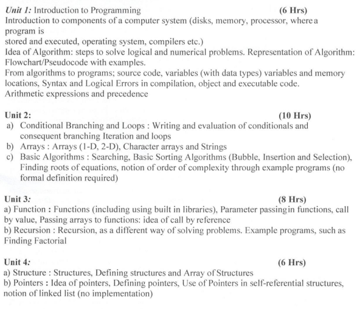
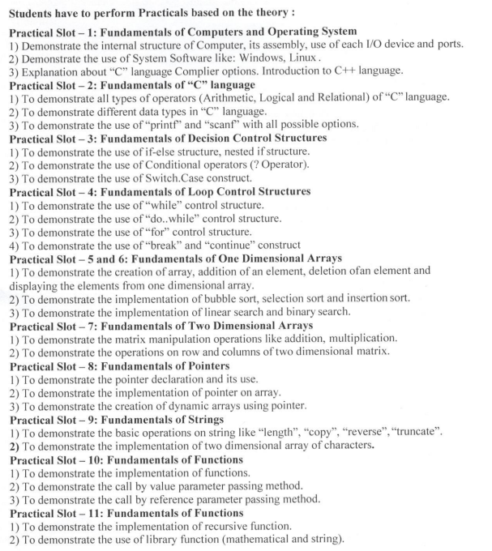

# RTMNU-SEM-2-CS

## Syllabus



## Practicals



- Organizational:
  - Indexed Folders, named a/c to the topic.

I use code-runner extension

[Code-Runner](https://marketplace.visualstudio.com/items?itemName=formulahendry.code-runner)

Go into Settings (JSON) and modify the `code-runner.executorMap`'s c and c++ lines to contain the following if on windows.
If you are working with *nix systems then you already know about gcc/g++/clang.

```json
        {
        "c": "cd $dir && clang $fileName -o $fileNameWithoutExt.exe && $fileNameWithoutExt.exe",
        "cpp": "cd $dir && clang $fileName -o $fileNameWithoutExt.exe && $fileNameWithoutExt.exe",
        }
```
